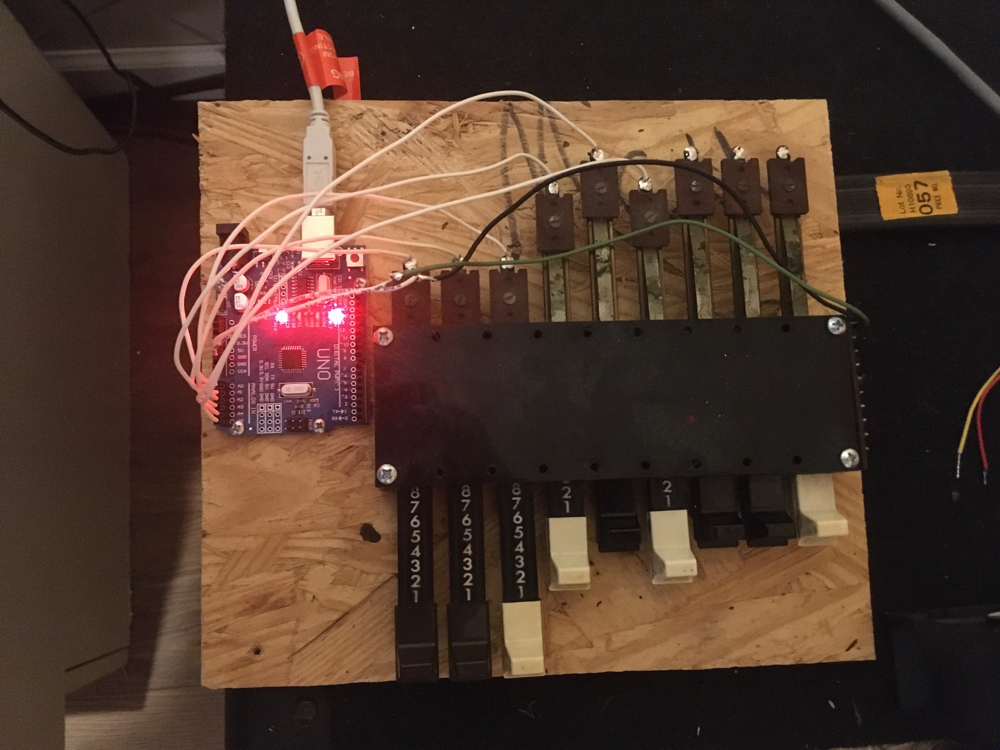

# CybNord
Arduino-based MIDI drawbars for the Nord Electro 

The Nord Electro in all its variants is the Hammond incarnation for the 21st century, but some versions don't have drawbars :(

I salvaged these drawbars from the guts of a scrapped parlor organ and wired them up to an Arduino Uno.  Right now only 6 of the 9 drawbars are wired up, because the Uno only has 6 ADC channels.  I'll probably add a shield with with switching so the existing ADC xhannels can scan 3 more drawbars.

